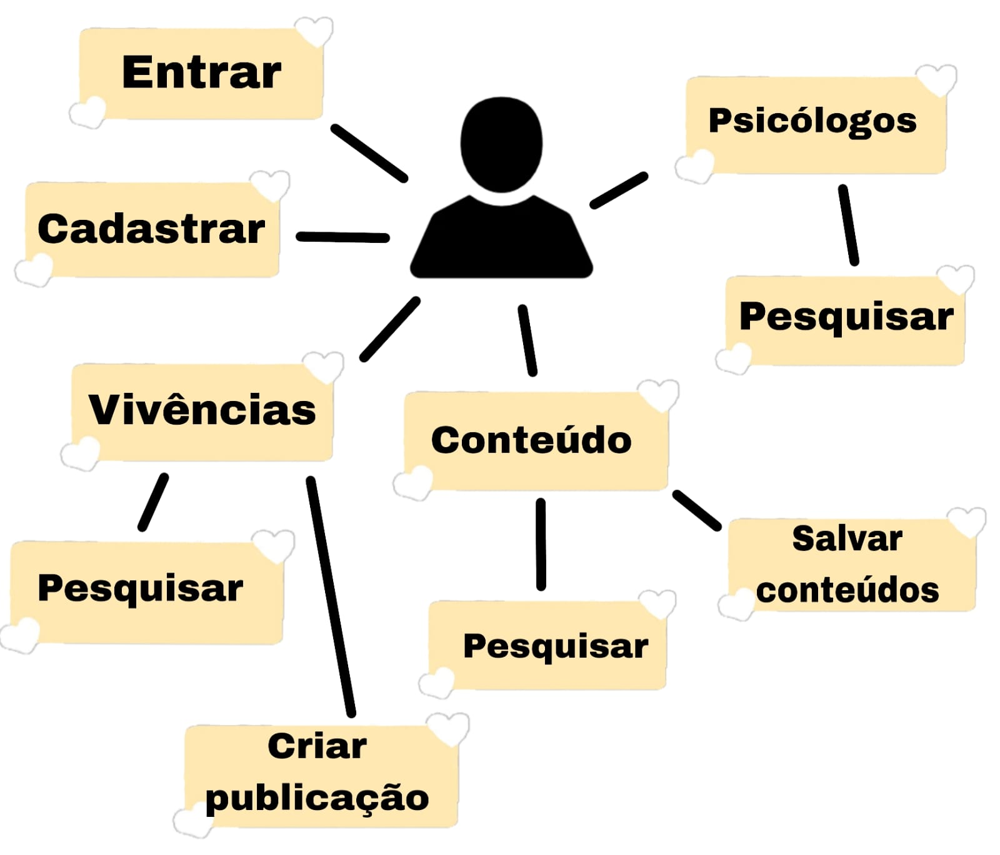

# Documentação do Projeto (TIDocs)

Esta pasta armazena a documentação do projeto para a disciplina de **Trabalho Interdisciplinar 1** dos cursos de Tecnologia da Informação da **[PUC Minas](https://pucminas.br)**. Essa documentação é estruturada na forma de um site que fica disponível por meio do GitHub Pages e pode ser incluído, também, no site da solução hospedada. Um [exemplo publicado do TIDocs](https://webtech-puc-minas.github.io/ti1-template/) está disponível por meio do repositório do **[WebTech PUC Minas](https://github.com/webtech-pucminas)**.

A documentação do projeto inclui as seguintes seções:

1. Introdução
2. Contexto
3. Concepção
4. Metodologia
5. Solução
6. FAQ (Questões frequentes)
7. Referências Bibliográficas

O template para o site é estruturado e permite que a equipe evolua a documentação do projeto à medida que avance no desenvolvimento.

# Orientações gerais

O projeto é um site que auxilia na falta de controle emocional. Ele oferece ferramentas que possam auxiliar o usuário, como vivências similares de demais usuários, meditações e músicas que visam uma maior tranquilidade, e psicólogos confiáveis para realizarem consultas.

## Problema

Milhões de pessoas ao redor do mundo estão enfrentando desafios significativos de desequilíbrio emocional, afetando indivíduos de todas as idades e classes sociais. Este fenômeno tem impactos profundos na qualidade de vida, na produtividade no trabalho e na saúde geral dos indivíduos.

A pandemia global exacerbou ainda mais esses problemas, destacando a urgente necessidade de soluções eficazes para ajudar as pessoas a gerenciar suas emoções de forma saudável e sustentável. A busca por abordagens inovadoras e acessíveis tornou-se crucial para mitigar os efeitos adversos desse desequilíbrio emocional generalizado.

## Objetivos

O objetivo ao desenvolver o software é amenizar os problemas da ansiedade, da tristeza e da raiva, ajudando o usuário a entender e a controlar melhor essas emoções.

## Justificativa

Atualmente muitas pessoas se sentem ansiosas, principalmente no Brasil, onde o índice de ansiedade é altíssimo. Isso se deve à pandemia, como nos outros países, mas também devido às várias mudanças na economia, o alto índice de desemprego, a falta de segurança pública, dentre outros. Também por causa desses fatores, o Brasil é um dos países com maior índice de depressão e, por isso, amenizar a ansiedade e a depressão é tão importante. As formas do nosso site de tentar amenizá-los também funciona para a raiva, por isso a incluímos em nossos objetivos.

## Público-Alvo
O site está aberto a qualquer pessoa que enfrente problemas emocionais, mas temos um foco particular em indivíduos entre 15 e 30 anos. Além disso, garantimos acessibilidade, pois priorizamos a compatibilidade com dispositivos móveis, dispensando a necessidade de um computador. A interface é intuitiva e simples de entender, projetada para ser utilizada por qualquer pessoa, independentemente do nível de familiaridade com tecnologia. Não é necessário um conhecimento avançado, apenas habilidades básicas.

## Personas
Bruno:

Ana Catarina:

## Histórias de Usuários
<table class="table">
  <thead>
    <tr>
      <th scope="col">EU</th>
      <th scope="col">
        EU QUERO/PRECISO...
      </th>
      <th scope="col">COMO EU ALCANÇARIA ESSE OBJETIVO?</th>
    </tr>
  </thead>
  <tbody>
    <tr>
      <th scope="row">Sandra</th>
      <td>
        Me sentir menos ansiosa e com mal estar.
      </td>
      <td>Lendo informações pertinentes e verídicas sobre temas de ansiedade.</td>
    </tr>
    <tr>
      <th scope="row">Pedro</th>
      <td>
        Pensar menos no meu futuro e gastar mais tempo com soluções.
      </td>
      <td>Por meio de ferramentas entratégicas para colocar soluções em prática, como conteúdos com vídeos e fotos para controle mental.</td>
    </tr>
    <tr>
      <th scope="row">Lívia</th>
      <td>
        Afetar menos a minha vida pessoal, e estar menos tensa com meu presente.
      </td>
      <td>Por meio de uma seção com psicólogos mais acessíveis e próximos a mim</td>
    </tr>
  </tbody>
</table>

## Requisitos

### Requisitos funcionais:
- Seção sobre meditações.
- Seção de vivências.
- Acesso a psicólgos próximos.

#### Requisitos não funcionais:
- Privacidade de informações pessoais.
- Psicólogos verificados pelo CEPP.
- Variedade de conteúdos.

## User Flow

## Wireframes

## Gestão de Projetos
Iniciamos o projeto com entrevistas detalhadas e coleta de dados dos usuários para criar personas. A partir dessas personas, identificamos o público-alvo e concebemos a visão inicial do projeto, definindo suas funcionalidades essenciais.

Para a gestão eficiente do projeto e da equipe, adotamos o aplicativo Trello e a metodologia Kanban para a divisão e acompanhamento das tarefas. Realizávamos reuniões semanais e alinhamentos diários para garantir o progresso contínuo e a sincronização das atividades realizadas.

### Divisão de Tarefas:

#### Organização Inicial
- Ana Luíza: responável pela documentação;
- Mariana: responsável pelo wireframe e o design thinking;
- João: responsável pelo o mapa de empatia, os slides da apresentação e o roteiro do pitch.

#### Organização: Desenvolvimento
- Ana Luíza: cadastro e amostra de vivências;
- Mariana: cadastro e amostra de psicólogos;
- João: cadastro e amostra de conteúdos;

## Links Importantes
- Miro: https://miro.com/app/board/uXjVKdBjxi4=/
- Figma: https://www.figma.com/design/Qs3WqeYkFjVvNWnZFOLCAg/TIAW---2x?node-id=0-1&t=AUlOafbe0Kn1PxNp-1

